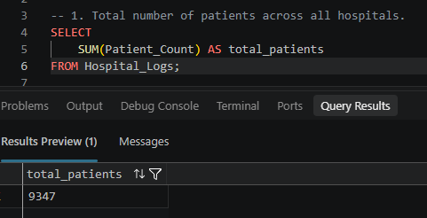
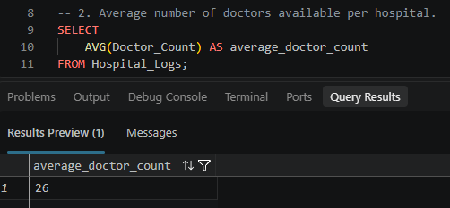

# Hospital Operations & Cost Analysis using SQL

## Project Overview

This project analyzes hospital operational and financial data using Microsoft SQL Server. The objective is to examine patient volume, departmental demand, doctor availability, treatment duration, and medical expenses to identify patterns that can support better operational and cost optimization.

The project follows an end to end SQL workflow, starting with database creation and data import, followed by data transformation and business analysis.

---

## Business Objectives

The analysis aims to answer the following questions:

1. How many patients were recorded across all hospitals?
  

2. What is the average number of doctors available?
  
  
4. Which departments have the highest patient volumes?
5. Which hospital recorded the highest medical expenses?
6. What is the medical expense per patient-day for each hospital?
7. How many patients were treated in each city?
8. Which departments have the longest average patient stay?
9. Which department has the lowest patient volume?
10. How do medical expenses vary over time?

These insights can help hospital management understand operational demand, resource allocation, departmental workload, and cost patterns.

---

## Tools Used

- Microsoft SQL Server
- SQL Server Management Studio (SSMS)

---
