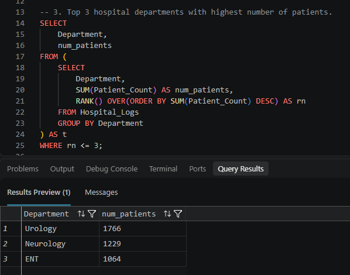
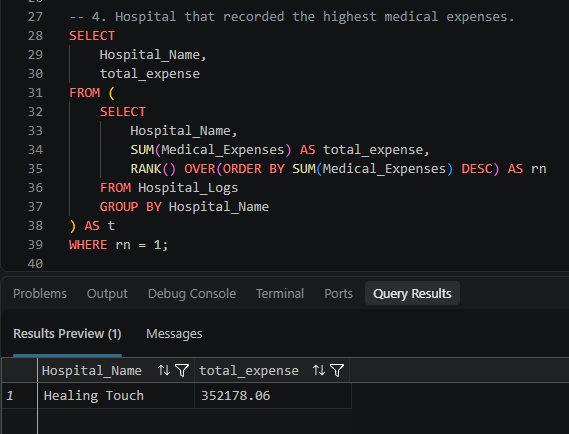
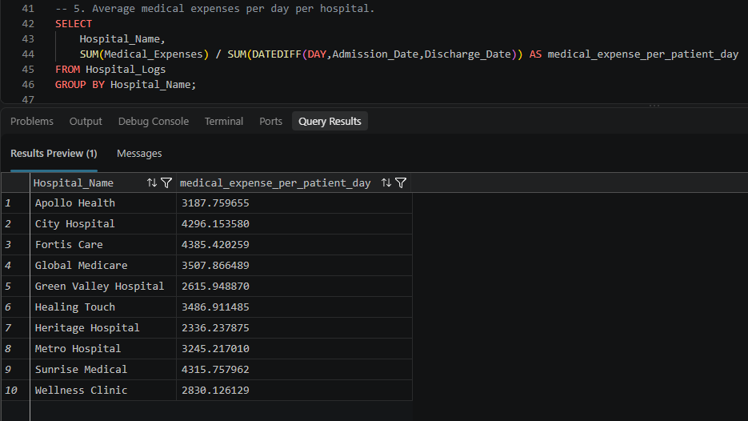
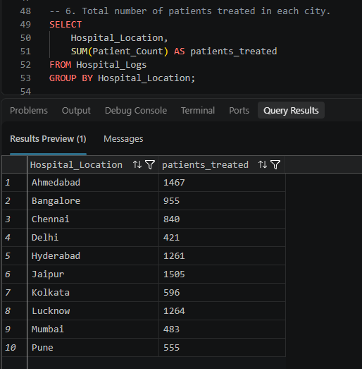
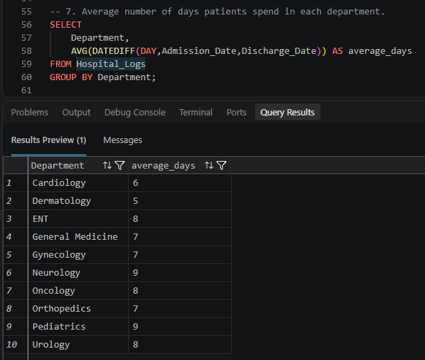
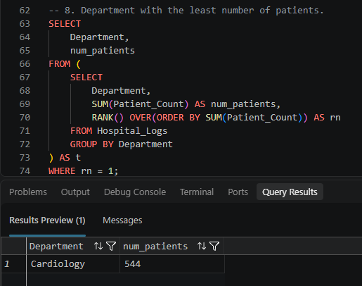
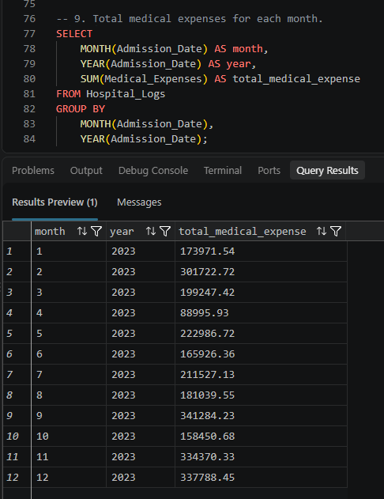

# Hospital Operations & Cost Analysis | SQL Server

> An end to end analysis of hospital operations and medical costs, covering raw data ingestion, staging, data transformation, database design and business analysis.

## Executive Summary

This project analyzes hospital operational and financial data to identify patterns in patient demand, departmental workload, hospital costs, doctor availability, treatment duration and geographic distribution.

The analysis was performed using Microsoft SQL Server and follows an end to end workflow:

**Raw CSV Data → Staging Table → Data Transformation → Final Analytical Table → Business Analysis**

The project answers key operational and cost related business questions using SQL and demonstrates practical skills in data ingestion, transformation, relational database design, aggregation, window functions, subqueries and analytical problem-solving.

---

## Business Objectives

The analysis aims to answer the following questions:

### Operational Demand
1. How many patients were recorded across all hospitals?
  
  

2. What is the average number of doctors available?
  
  
  
3. Which departments have the highest patient volumes?
  
  
### Cost Analysis
4. Which hospital recorded the highest medical expenses?
  
  

5. What is the medical expense per patient-day for each hospital?
  
  
### Operational Efficiency
6. How many patients were treated in each city?
  
  

7. Which departments have the longest average patient stay?
  
  
### Geographic and Trend Analysis
8. Which department has the lowest patient volume?
  
  

9. How do medical expenses vary over time?
  
  

These insights can help hospital management understand operational demand, resource allocation, departmental workload, and cost patterns.

---

## Tools Used

- Microsoft SQL Server
- SQL Server Management Studio (SSMS)

---

## Key Findings & Business Insights

### Patient Demand

* **Urology** department recorded the highest patient volume, indicating the highest demand among the analyzed departments.
* **Cardiology** department recorded the lowest patient volume, suggesting comparatively lower patient demand.

### Cost Performance

* **Healing Touch** Hospital recorded the highest total medical expenses.
* Hospitals with higher patient day costs may require further analysis to determine whether the increased cost is driven by treatment duration, patient complexity or higher medical expenses.

### Length of Stay

* **Neurology** and **Pediatrics** have the longest average patient stay.
* Longer stays may indicate higher treatment complexity or potentially lower patient throughput. Additional clinical data would be required before drawing a definitive performance conclusion.

### Geographic Demand

* Patient volume varied across hospital locations, highlighting potential differences in regional healthcare demand.

### Management Implications

Based on these findings, management could prioritize:

1. Resource allocation toward high demand departments.
2. Further investigation of hospitals with high total medical expenses and high cost per patient day.
3. Review of departments with longer average patient stays.
4. Capacity planning based on city level patient demand.

---

## Skills Demonstrated

Data Ingestion: BULK INSERT | CSV Import | Staging Tables

Data Transformation: CONVERT | DATE Parsing | INSERT...SELECT

Database Design: CREATE TABLE | PRIMARY KEY | IDENTITY | CHECK Constraints

Data Analysis: SUM | AVG | GROUP BY | DATEDIFF | RANK | Window Functions | Subqueries

Business Analysis: Operational Demand | Cost Analysis | Length of Stay | Geographic Analysis

---

## Work Flow

Raw CSV -> Staging Table (Raw Records) -> Transformation (Date Parsing) -> Final Table (Hospital_Logs) -> Business Analysis

---

## Data Preparation and Transformation

The source dataset was imported into a staging table before being loaded into the final analytical table.

### Key transformation

The raw date values were stored in the following format:

DD-MM-YYYY

To ensure proper date calculations and SQL Server compatibility, these values were converted into the DATE datatype using style code 105.

This enabled accurate:

- Patient stay calculations using DATEDIFF
- Monthly analysis
- Date based aggregations

The staging table was dropped after the cleaned data was successfully loaded into the final table.

---

## Data Quality Considerations & Assumptions

The analysis is based on the structure and available fields in the source dataset.

Key considerations include:

* Patient volume is represented using the `Patient_Count` field rather than individual patient level records.
* Patient stay duration is calculated as the difference between `Admission_Date` and `Discharge_Date`.
* Medical expense analysis is based on the `Medical_Expenses` field available in the dataset.
* Higher medical costs do not necessarily indicate poor performance, as costs may be influenced by patient complexity, treatment type, hospital capacity and other factors not available in the dataset.
* The analysis is descriptive and intended to identify patterns that may require further investigation.

---
